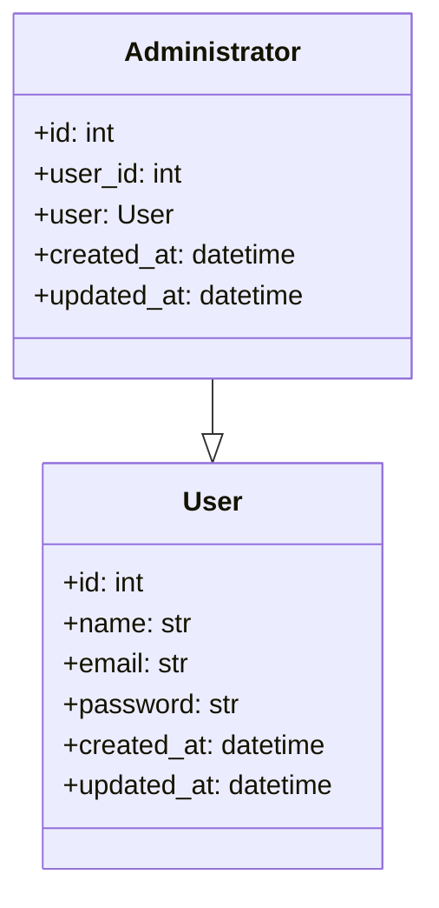

# Administrator Entity

::: src.entities.administrator_entity

## Administrator Entity Diagram

The above diagram represents the relationship between the `Administrator` and `User` entities. It shows that the `Administrator` entity has a one-to-one relationship with the `User` entity.
