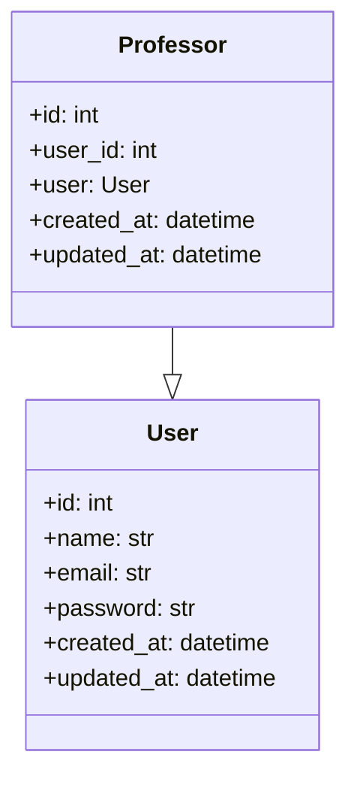

# Professor Entity

::: src.entities.professor_entity

## Professor Entity Diagram

The above diagram represents the relationship between the `Professor` and `User` entities. It shows that the `Professor` entity has a one-to-one relationship with the `User` entity.
