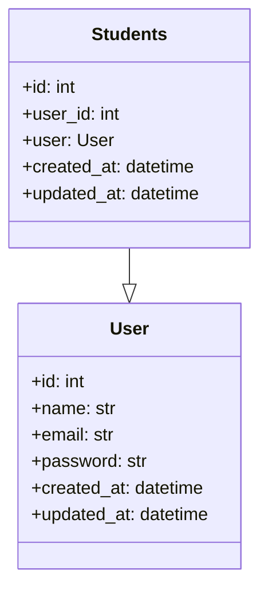

# Students Entity

::: src.entities.students_entity

## Students Entity Diagram

The above diagram represents the relationship between the `Students` and `User` entities. It shows that the `Students` entity has a one-to-one relationship with the `User` entity.
