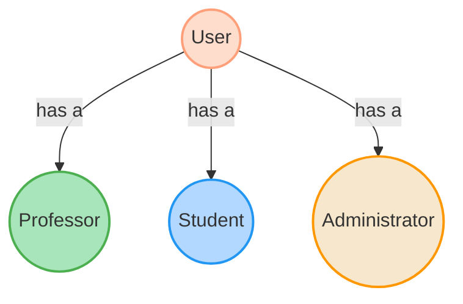

# User Types

In our system, there are three main user types: `Professor`, `Student`, and `Administrator`. Each user type has different roles and responsibilities.

## Professor

A professor can:

- Teach one or more courses
- Create and manage exams for their courses

## Student

A student can:

- Enroll in one or more courses
- View and complete assignments for their courses

## Administrator

An administrator can:

- Manage courses
- Manage users

## User Types Diagram

